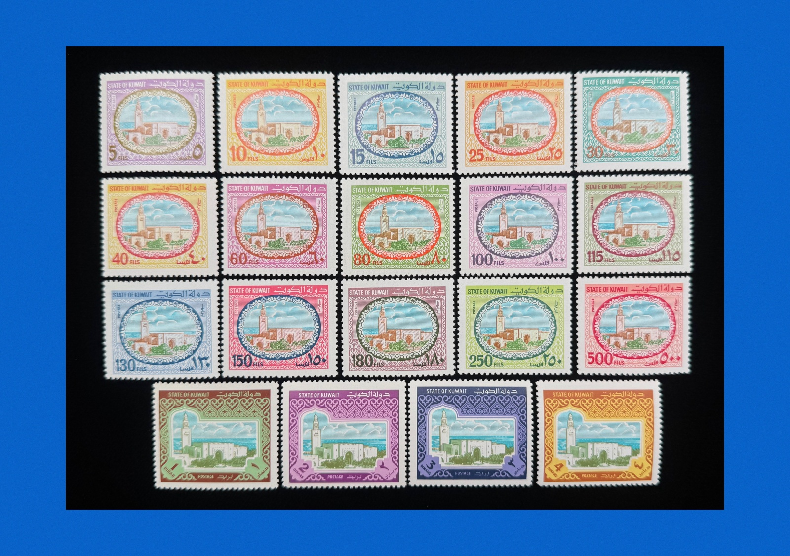
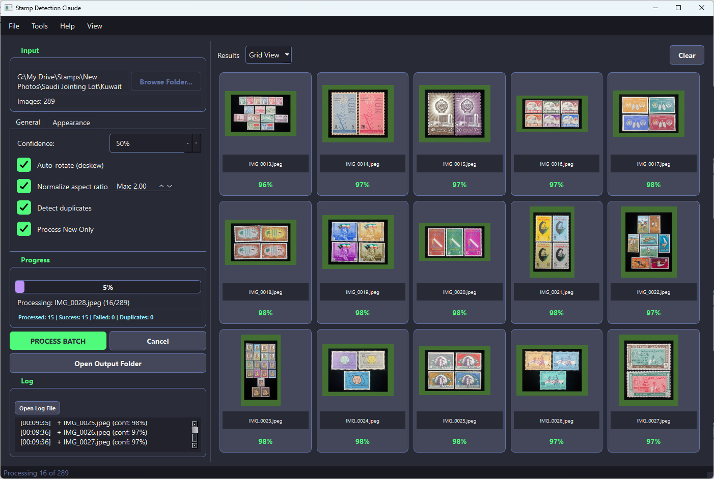

<div align="center">

# 🎯 Stamp Philatex Processor

### *AI-Powered Stamp Detection, Alignment & Cropping System*


---

**Transform chaotic stamp scans into perfectly aligned, professionally cropped images**

*Perfect for stamp collectors, dealers, and eBay sellers*

[🚀 Quick Start](#-quick-start) • [✨ Features](#-features) • [📖 Documentation](#-documentation) • [🤝 Contributing](#-contributing)

</div>

---

## 📋 Overview

**Stamp Philatex Processor** is an intelligent automation tool that revolutionizes how stamp collectors process their scanned images. Using state-of-the-art YOLOv8 instance segmentation, it automatically detects individual stamps, aligns tilted ones, and crops them with professional green textured borders - ready for eBay listings or digital catalogs.

### 🔄 Workflow Transformation

<table align="center">
  <tr>
    <td align="center"><b>Before Processing</b></td>
    <td align="center"><b>After Processing</b></td>
  </tr>
  <tr>
    <td></td>
    <td></td>
  </tr>
  <tr>
    <td align="center"><em>Messy scan with multiple tilted stamps</em></td>
    <td align="center"><em>Perfectly aligned, cropped with textured borders</em></td>
  </tr>
</table>

### 💻 Application Interface

<p align="center">
  
</p>

<p align="center"><em>The professional PyQt6 interface showing real-time stamp detection and processing</em></p>

---

---

## ✨ Features

### 🔍 AI-Powered Detection
- **YOLOv8 Instance Segmentation** - Pixel-perfect stamp boundary detection
- **Batch Processing** - Process hundreds of images in minutes
- **Multi-Stamp Support** - Detects and processes multiple stamps per image

### 📐 Smart Auto-Alignment
- **Hough Line Detection** - Analyzes actual stamp edges for precise angles
- **Sub-Degree Accuracy** - Corrects tilts as small as 0.3°
- **Intelligent Fallback** - Uses minAreaRect when edge detection fails

### 🎨 Professional Output
- **Textured Borders** - Beautiful green felt texture backgrounds
- **eBay Optimized** - Output sized at 1600px max for listings
- **Customizable Margins** - Adjust expansion and border percentages

### 🔄 Duplicate Detection
- **Perceptual Hashing** - Find duplicate stamps across batches
- **Cross-Batch Checking** - Compare against previously processed stamps
- **Smart Flagging** - Mark duplicates for review

### 💻 Modern Interface
- **Professional GUI** - Dark theme PyQt6 interface
- **Drag & Drop** - Drop folders or files directly
- **Real-time Preview** - See results as they process
- **Theme Toggle** - Switch between dark/light modes

### 🖥️ Hardware Support
- **AMD GPU** - DirectML acceleration
- **NVIDIA GPU** - CUDA support
- **Apple Silicon** - MPS support
- **CPU Fallback** - Works on any system

---

## 🚀 Quick Start

### Prerequisites
- Python 3.9 - 3.11
- Conda (recommended) or pip
- 8GB RAM minimum (16GB recommended)

### Installation

```bash
# Clone the repository
git clone https://github.com/matef88/Stamp-Philatex-Processor.git
cd stamp-philatex-processor
```

# Create conda environment
conda create -n stamp_env python=3.11
conda activate stamp_env

# Install dependencies
pip install -r requirements.txt

# For AMD GPU support (Windows)
pip install torch-directml
```

### Run the Application

```bash
# Start the GUI
python run_gui.py
```

### Process Your First Batch

1. **Select Images** - Click "Browse Folder" or drag & drop
2. **Configure Settings** - Adjust margins, colors, and detection threshold
3. **Process** - Click "Process Batch" and watch the magic happen
4. **Find Results** - Check the `output/crops/` folder

---

## 📖 Documentation

| Document | Description |
|----------|-------------|
| [INSTALLATION.md](docs/INSTALLATION.md) | Detailed installation guide |
| [USAGE.md](docs/USAGE.md) | Complete usage instructions |
| [CONFIGURATION.md](docs/CONFIGURATION.md) | Configuration options |
| [TRAINING.md](docs/TRAINING.md) | Train your own model |

---

## 📁 Project Structure

```
stamp-philatex-processor/
├── 📄 run_gui.py              # GUI entry point
├── 📄 config.yaml             # Configuration settings
├── 📄 requirements.txt        # Python dependencies
│
├── 📂 gui/
│   ├── main_window.py         # PyQt6 main interface
│   └── resources/             # GUI assets
│
├── 📂 scripts/
│   ├── process_stamps.py      # Core processing engine
│   ├── duplicate_detector.py  # Duplicate detection
│   ├── train.py               # Model training
│   ├── utils.py               # Utility functions
│   └── ...                    # Other modules
│
├── 📂 launchers/
│   ├── run_gui.bat            # Windows GUI launcher
│   └── ...                    # Other launchers
│
├── 📂 assets/
│   └── green_texture.jpg      # Default border texture
│
├── 📂 docs/
│   ├── INSTALLATION.md
│   ├── USAGE.md
│   └── ...
│
└── 📂 models/                 # Trained AI models (download separately)
    └── stamp_detector_seg/
        └── weights/best.pt
```

---

## ⚙️ Configuration

Key settings in [`config.yaml`](config.yaml):

```yaml
# Detection sensitivity
detection:
  confidence_threshold: 0.5    # Lower = more detections

# Processing options
processing:
  rotation_correction: true    # Auto-align tilted stamps
  expand_margin_percent: 0.05  # Background context (5%)
  texture_margin_percent: 0.10 # Green border (10%)

# Hardware
hardware:
  device: "directml"           # cuda, directml, mps, or cpu
```

---

## 🎯 Use Cases

### 📦 eBay Sellers
- Batch process stamp collections
- Professional presentation with textured borders
- Duplicate detection to avoid listing errors

### 🏛️ Collectors
- Digitize physical collections
- Create organized digital catalogs
- Track inventory with Excel export

### 📚 Dealers
- Process customer consignments quickly
- Maintain consistent image quality
- Generate inventory reports

---

## 🏋️ Training Your Own Model

### Option A: Google Colab (Free GPU)
1. Upload your dataset to Google Drive
2. Open [`notebooks/train_stamps_colab.ipynb`](notebooks/train_stamps_colab.ipynb)
3. Run all cells with GPU runtime

### Option B: Local Training
```bash
python scripts/train.py
```

### Dataset Preparation
1. Label images using [Roboflow](https://roboflow.com)
2. Export as **YOLOv8 Segmentation** format
3. Place in `dataset/` folder

---

## 🛠️ Troubleshooting

| Issue | Solution |
|-------|----------|
| No stamps detected | Lower `confidence_threshold` to 0.3 |
| Module not found | Run `pip install -r requirements.txt` |
| GPU not detected | Install appropriate PyTorch version |
| Stamps not aligned | Enable "Show alignment line" to debug |

See [docs/TROUBLESHOOTING.md](docs/TROUBLESHOOTING.md) for more solutions.

---

## 🤝 Contributing

Contributions are welcome! Please feel free to submit a Pull Request.

1. Fork the repository
2. Create your feature branch (`git checkout -b feature/AmazingFeature`)
3. Commit your changes (`git commit -m 'Add some AmazingFeature'`)
4. Push to the branch (`git push origin feature/AmazingFeature`)
5. Open a Pull Request

---

## 📝 License

This project is proprietary software. All rights reserved. See the [LICENSE](LICENSE) file for details.

**Note:** This is NOT open source or free software. Commercial use requires a separate license.

---

## 🙏 Acknowledgments

- [Ultralytics](https://ultralytics.com) for YOLOv8
- [Roboflow](https://roboflow.com) for dataset management
- [PyQt6](https://riverbankcomputing.com) for the GUI framework
- [OpenCV](https://opencv.org) for image processing

---

<div align="center">
    

    
**Built with ❤️ for stamp collectors worldwide**

⭐ Star this repo if you find it useful! ⭐

[Report Bug](https://github.com/matef88/Stamp-Philatex-Processor/issues) · [Request Feature](https://github.com/matef88/Stamp-Philatex-Processor/issues)
</div>


